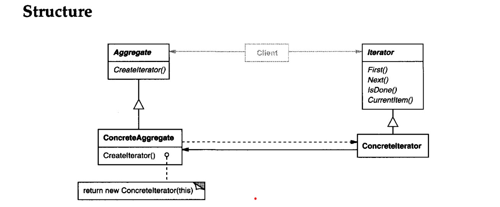

Intent
---------
*Provide a way to access the elements of an aggregate object sequentially without
exposing its underlying representation.*

1. The key idea in this pattern is to take the responsibility for access and traversal out of the list object 
and put it into an iterator object. 
2. The Iterator class defines an interface for accessing the list's elements. An iterator object is responsible
for keeping track of the current element; that is, it knows which elements have been traversed already.

