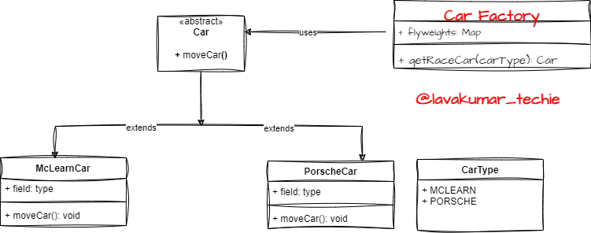

Intent
------
*is a behavioral design pattern that lets you fit more objects into the available amount of RAM
by sharing common parts of state between multiple objects instead of keeping all the data in each object*

A flyweight is a shared object that can be used in multiple contexts simultaneously.
The flyweight acts as an independent object in each context—it's indistinguishable from an instance of the object that's not shared.
Flyweights cannot make assumptions about the context in which they operate.

The key concept here is the distinction between intrinsic and extrinsic state.
1. Intrinsic state is stored in the flyweight; it consists of information that's independent of the flyweight's context,
thereby making it sharable. 
2. Extrinsic state depends on and varies with the flyweight's context and therefore can't be shared. Client objects are responsible for 
passing extrinsic state to the flyweight when it needs it.

Implementation:
--------------
In Flyweight pattern we use a `**HashMap** |(or Any Data Set Which serves as Cache)` that stores reference to the object which have already been created, 
every object is associated with a key. Now when a client wants to create an object, he simply has to pass a key associated with it and
if the object has already been created we simply get the reference to that object else it creates a new object and then returns it reference to the client.