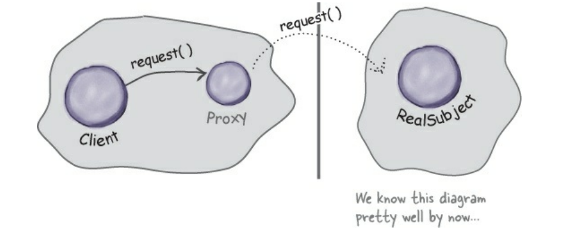

Intent
------
*Proxy is a behavioral design pattern that lets you provide a substitute or placeholder for another object.
A proxy controls access to the original object, allowing you to perform something either before or after the request gets through to the original object.*

3 Ways of Proxy
----------------
1. Remote proxy
2. Virtual Proxy
3. Protection Proxy

Remote Proxy:
--------------
With Remote Proxy, the proxy acts as a local representative for an object that lives in a different JVM.
A method call on the proxy results in the call being transferred over the wire, invoked remotely,
and the result being returned to the proxy and then to the Client

Virtual Proxy:
-------------
The virtual proxy design pattern is used to preserve memory from being allotted to an object that may not be used
in the future. Until the object is not used, a light copy of the object (that contains the required details)
is created and shown to the user.
1. Creating Object On Demand ( Creating Object When call Check SingleTon Replace in Proxy Class)
2. Show Minimum Required - (On Demand Show Full Details - We Discussed here)
3. Acts as a Cache Layer ( Chrome storing recent search data in ur local internal storage)

Protection proxy:
-----------------
1. If an application does not have access to some resource then such proxies will talk to the objects
in applications that have access to that resource and then get the result back.
2. When we access to website over internet and for some websites which are malicious are usually blocked in some orgs
and workplaces. Here They have implemented protection proxy. The proxy first checks the host you are connecting to,
if it is not part of restricted site list, then it connects to the real internet
